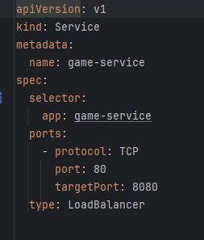
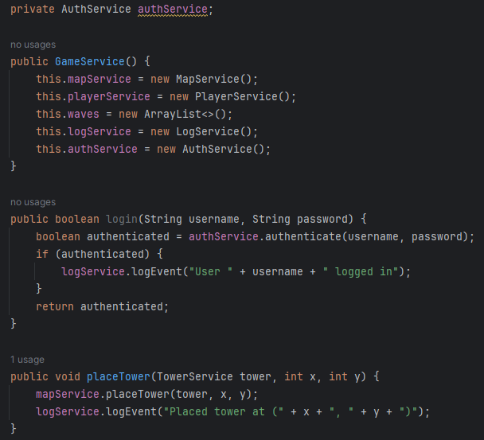

## V3
Vamos a crear microservicios de todas las clases existentes, para esto necesitamos crear los archivos Dockerfile para cada clase

Posteriormente, creamos las 5 imagenes 

Usamos "docker-compose" para iniciar y ejecutar múltiples contenedores definidos en un archivo docker-compose.yml

Creamos los deployments que utilizan la imagen creada para ejecutarse en el cluster de kubernetes

Usamos minikube para crear un clúster de Kubernetes local y desplegamos los deployment que nos asegura que una copia esté corriendo en nuestro contenedor

Revisamos los pod que sería la unidad más pequeña y simple de despliegue. Creados en el momento del despliegue

Creamos los servicios que ayudan al pod para darle una IP , que utilizan las   y luego lo lanzamos. Además utilizamos LoadBalancer para balancear la carga 

## Implementacion de tests
*GameTest*
Probamos la inyección de mockTower en el constructor de gameService y su posterior verificaión

*TowerTest*
Tenemos 2 tests el primero comprueba que retorna el simbolo correcto para una torre. El otro que la creación de la torre fue correcta y que retorna correctamente el simbolo que se le pasó por el constructor

*PlayerTest*
Los 3 tests unitarios comprueban el correcto retorno de los getters de la clase player

*MapTest*
El primer test verifica la grilla si ubicamos la torre en una posición
El segundo test verifica la grilla sin poner torres sea correcta

## Configuración pitest
En nuestro build.gradle agregamos las siguientes lineas

## Resultados
En pruebas pasadas la ejecución de pitest no tuvo problema sin embargo en esta ocasión no se pudo ejecutar

## Ejercicio 1

En este ejercicio crearemos un microservicio para registrar las acciones importantes que pasan en nuestro juego como la creación de torres o nuestro puntaje

*Creación de docker-compose*
Docker-compose nos permite gestionar los multiconedores y multiservicio que hemos creado y indicar como queremos que sean construidos, ejecutados y conectados a los contenedores.

*Implementamos la clase LogService*
Esta clase tiene un único método que recibe los eventos y los va registrando en un txt 

*Creamos el dockerFile*

*Modificamos las otras clases*
Al colocar una torre o iniciar una nueva oleada se envía un evento a LogService

*Ejecución docker-compose up*
Construye, crea y ejecuta los contenedores mencionados en docker-compose.yml

## Ejercicio 2
Implementaremos un microservicio de autentifación para usuarios.

*Creación de la clase AuthService*

Esta clase tiene un Hash de usuarios(nombre, contraseña) y un método para verificar la existencia de un usuario en nuestros usuarios válidos 

*Modificación de otras Clases*
En este caso modificaremos GameService para que se requiera logearse para poder jugar, pedirá usuario y contraseña y le enviará un evento registrando el correcto logeo

*Creación dockerfile*

Creamos un nuevo dockerfile para esta clase

*Modificación docker-compose*

Debido a las modificaciones debemos indicar la ubicación y el nombre del dockerfile

*Ejecución de docker-compose up*

Ejecutamos docker-compose y verificamos que no hayan errores
